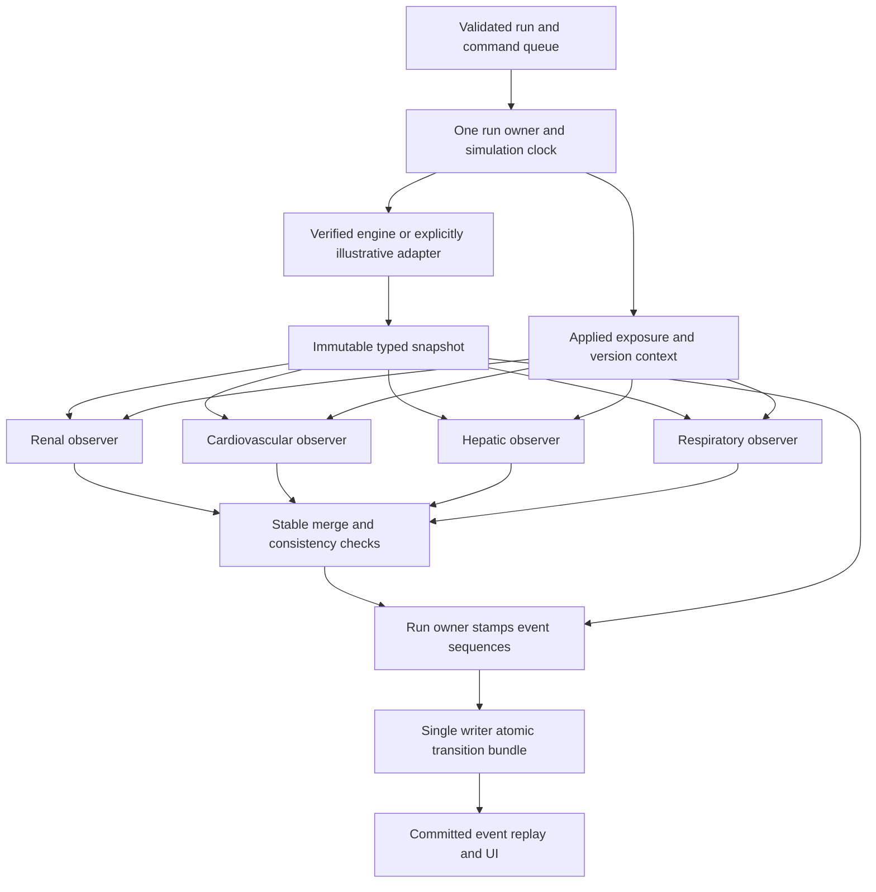

# Independent audit: Physiological Digital Twin Sandbox

Audit date: 2026-10-04. Scope: existing Gates 0–6 and the proposed integration boundary. Application code was not modified during the audit. Subsequent user-authorized repairs are tracked separately in `docs/implementation-progress.md`; this report and its results describe the original source version.

## 1. Verdict

**The architectural direction is appropriate; the existing implementation is not ready for Gate 7.** Keep the one-engine, observer-council, local modular-monolith design. Repair the engine provenance, contracts, persistence, sequencing and worker lifecycle before connecting LangGraph or exposing these operations to the browser.

This is a research/education prototype. Passing engineering tests would establish specific software properties, not the ability to predict an individual patient's drug response or surgical outcome. No audit can establish “zero hidden bugs” or “flawless execution.” The practical objective is explicit contracts, reproducible tests, small changes and observable failures.

| Gate | Assessment |
|---|---|
| 0: environment | Runnable in an isolated audit environment; dependency reproducibility still needs a lock/pinned environment. |
| 1: engine feasibility | **Not established for Pulse or genuine reference traces.** The feasibility script passes a handcrafted model. |
| 2: coverage | Useful structure, but capabilities disagree with adapter behavior and CKD is misrepresented. |
| 3: contracts | Missingness validator is useful; snapshots are mutable and permit untyped invalid quantities; validity/provenance drift exists. |
| 4: persistence/events | WAL and foreign keys are present; cross-run overwrites, non-atomic bundles and sequence/version problems block integration. |
| 5: worker | Interval splitting works for tested boundary cases; lifecycle, engine-return handling, idempotency and restoration are incomplete. |
| 6: evidence | Three initial rules exist; predicate semantics, review eligibility, source precision and derivation records need repair. |

## 2. What was actually verified

The audit inspected all 26 Python/JSON files under `backend/`, `simulation/` and `tests/`, including package initializers; reviewed requirements, pytest configuration and architecture/implementation documents. File hashes and line counts are recorded in `artifacts/audit/summary.json`. References below refer to this audited version.

- Existing suite: **39 passed**, 2.37 seconds, after putting pytest temporary files inside the workspace. The earlier temporary-directory setup failure was an audit environment issue, not an application defect.
- Independent probes in `scripts/audit_regressions.py`: **40 checks, 37 failed, 3 passed**, 1.27 seconds. These are deliberately adversarial acceptance checks. Failures overlap; **37 failed checks does not mean 37 distinct defects**.
- The three passing controls cover cancellation waking a paused worker; t=0, same-time and horizon interventions; and file-backed SQLite query plans/foreign-key/integrity checks. Evidence-only numerical isolation was also covered by the existing suite.
- Actual feasibility execution reported `pulse_native_available=false` and `gate1_passed=true`. Its resource measurements apply to the handcrafted adapter, not Pulse.
- Environment: Python 3.12.14, Pydantic 2.13.5, pytest 9.1.1, FastAPI 0.142.2, psutil 7.2.2, SQLite 3.53.1. Dependencies were installed separately in `.audit-deps`; the developer's exact Gemini environment was not reproduced.
- Evidence: `artifacts/audit/existing-suite.xml`, `probes.xml`, `feasibility-output.txt`, `summary.json`. Reproduction instructions: `artifacts/audit/README.md`.

Limitations: no real Pulse lifecycle/clinical validation was demonstrated, no frontend/API exists to test here, and no exhaustive scheduler interleaving or long-duration resource soak was performed. A32 tests a future caller contract: the current registry accepts a list named `active_interventions`, so filtering future events may properly belong to its caller. A34 tests a corrected missing-data requirement, explained below. A04 uses a deliberately tight numerical tolerance; it demonstrates step dependence, not a clinically significant error magnitude.

## 3. Correct the audit requirements before implementing them

1. **Keep missing measurements missing, but preserve independently supported warnings.** If a rule truly requires eGFR, missing eGFR makes that evaluation unknown. If the rule is simply a qualitative NSAID caution for documented kidney disease, do not erase that warning because an unused numerical lab is absent. Emit the evidence warning and a separate limit on quantitative personalisation. “Unknown” and “no rule matched” never mean safe. NIDDK discusses NSAID kidney risks in this context: [Keeping your kidneys safe](https://www.niddk.nih.gov/health-information/kidney-disease/keeping-kidneys-safe).
2. **WAL is not a substitute for application ownership.** SQLite permits one writer at a time and can still return `SQLITE_BUSY` in WAL mode. A lock on one Python object does not serialize other instances or processes. Specify one writer owner, transaction boundaries, bounded busy handling and shutdown. [SQLite WAL documentation](https://www.sqlite.org/wal.html).
3. **A reference replay is not a fresh simulation.** It can reproduce an exact recorded scenario with proven provenance. It cannot calculate a new medication/dose branch unless a genuine engine recomputes it, or an exact matching trace already exists.
4. **Engine capabilities belong to the active, verified adapter.** Do not declare a capability supported because an engine family might support it, or universally unsupported because this adapter does not. Distinguish genuine numerical simulation, exact recorded replay, illustrative output, evidence-only rules and unsupported inputs.

## 4. Defect registry

Critical means misleading scientific provenance or a defect that can corrupt authoritative data/state. Moderate means a correctness/integration gap requiring repair before affected features ship. Minor means maintenance or presentation debt. This is software triage, not a clinical urgency rating.

### F01 — Critical: handcrafted curves presented as Pulse reference output

Locations: `simulation/adapter.py:59–101,115–141,205–264`; `simulation/capability-manifest.json:3–7`; `simulation/feasibility_check.py:67–68,162,175`.

The adapter reads no reference-trace dataset and calls no Pulse engine. It uses constants and handcrafted update rates, then labels values `source="pulse_reference_engine"` and `capability="engine_simulated"`. The manifest says `REFERENCE_TRACE_REPLAY`. Feasibility prints an anti-fabrication pass without proving the source of a trajectory. A missing Python module does not prove a particular Windows/Python compilation limitation.

Remedy: choose and prove the execution mode first. For actual Pulse, record SDK identity/version and a real initialize/action/advance/save/restore test. For replay, require scenario hash, trace file hash, producing engine version and reproducible generation record; reject nonmatching numerical scenarios. For the present formulas, label every output **illustrative**, remove Pulse attribution and avoid claims of patient prediction. Renaming the class alone is insufficient. Probe: A01. A provenance feasibility test must fail if the alleged trace file or generation record is absent.

### F02 — Critical: patient inputs silently ignored; patient state can carry over

Locations: `simulation/adapter.py:106–144`; `backend/schemas/domain.py:12–32`.

Provided baseline measurements are not used or disclosed as ignored. Creatinine is assigned a constant or a CKD-dependent constant. Reinitializing an adapter after a CKD patient leaves state inherited by a healthy patient. The baseline contract preserves missingness at construction, but that does not establish truthful output personalisation.

Remedy: reset all engine state before each initialization; reject reuse while a run is active. Record, per input, whether it was applied, context-only, unsupported, or replaced by an explicitly acknowledged model assumption. Keep measured baselines separate from model-initial values. Never synthesize a missing lab from diabetes or a disease flag. Probes: A02, A03; add independent tests for every advertised baseline input.

### F03 — Critical: CKD conflated with renal artery stenosis

Locations: `simulation/coverage.py:46–49`; `simulation/capability-manifest.json:195–201`; `docs/initial-conditions.md:14–18`.

Generic CKD is aliased to `ChronicRenalStenosis`. Pulse describes renal stenosis as renal artery narrowing; that is not a generic representation of chronic kidney disease or diabetic nephropathy. [Pulse scenario documentation](https://pulse.kitware.com/_scenario_file.html).

Remedy: retain renal stenosis as its specific condition. Represent CKD/diabetes as context until an appropriate model and parameter mapping are actually verified. Document limitations; correct presets and evidence predicates consistently. Test that adding diabetes neither generates eGFR nor silently enables a renal stenosis action.

### F04 — Moderate: declared actions and actual action dispatch disagree

Locations: `simulation/adapter.py:146–186`; `simulation/capability-manifest.json:283–331`; `simulation/coverage.py:285`; `simulation/worker.py:104,132,208,234,249`.

Coverage advertises norepinephrine, naloxone and oxygen behavior absent from the dispatcher. Dehydration checks a `type` field absent from the typed Intervention; the worker supplies a name instead. The worker ignores initialization, advance and apply return values and logs a rejected action as applied. Coverage reporting is not sufficient execution enforcement.

Remedy: use canonical ingredient/action identifiers and the active adapter's tested capability registry. Return a typed outcome; evidence-only events bypass numerical application. Unsupported/rejected actions must not emit `INTERVENTION_APPLIED`. Initialization/advance failure transitions the run to failure and preserves the last trustworthy snapshot. Probes: A06, A07, A28. Also verify every manifest action through the public typed worker path.

```python
# Interface sketch; define these types and semantics before implementation.
outcome = adapter.apply_event(validated_action)
if outcome.kind == "rejected":
    raise EngineActionError(outcome.reason)
if outcome.kind == "numerical_applied":
    commit_applied_action(outcome)
# Evidence-only scheduling is recorded separately; it never reaches this branch.
```

### F05 — Critical: dose/unit/duration ignored by numerical formulas

Locations: `simulation/adapter.py:146–237`.

Zero-dose saline adds fluid: the probe adds 1.2 L over 60 seconds. Numerical actions ignore dose, unit, route and duration and can remain active indefinitely. The purported conservation assertion is not established. Different advance step sizes also change output, though the A04 difference is small.

Remedy: actual numerical actions must use engine-supported dose/route/unit semantics and terminate as specified. Reject unsupported combinations. If retaining an illustrative model, make its limited behavior explicit and verify its own elementary invariants; do not make it appear medically validated. Separate solver integration steps from output sample cadence and define a justified numeric tolerance. Probes: A04, A05; add zero dose, duration expiry, unit conversion and no-op conservation cases.

### F06 — Critical: council input is mutable and schema validation can be bypassed

Locations: `backend/schemas/domain.py:93–124`.

Agents can mutate shared nested quantities. `Union[QuantitySnapshot, Dict[str, Any]]` accepts malformed values such as `"banana"`. The adapter returns `validity.is_physiologically_valid`; the schema expects `is_valid` and silently ignores the former, so invalid output becomes valid by default.

Remedy: use one strict typed snapshot contract, forbid extra fields at boundaries, validate finite typed quantities and map engine validity explicitly. Freeze nested quantity values and use an immutable container or isolated observer views. `frozen=True` alone does not freeze a contained dictionary. [Pydantic model documentation](https://pydantic.dev/docs/validation/latest/concepts/models/). Probes: A08, A09, A10.

```python
class QuantitySnapshot(BaseModel):
    model_config = ConfigDict(frozen=True, extra="forbid")
    value: FiniteFloat | None
    unit: str
    provenance: QuantityProvenance

# For council input, prefer a tuple of frozen named quantities, or a protected
# mapping built at the boundary. Do not leave Dict[str, Any] as an escape route.
# Explicit adapter conversion must carry validity and numerical error codes.
```

### F07 — Moderate: request bounds and capability contract drift

Locations: `backend/schemas/domain.py:66–90`; `simulation/capabilities.py:65–72`; `simulation/capability-manifest.json:3–7`.

Units/routes are arbitrary strings; infinite horizons pass validation. The typed manifest uses names different from the JSON (`adapter_mode` versus `execution_mode`, `engine_available` versus `engine_available_locally`) and silently drops metadata. Profile hashes and engine-version claims are not verified. `AgentFinding.coverage` at `backend/schemas/domain.py:149` also excludes `illustrative`, although the capability taxonomy includes it; a truthful illustrative mode needs an explicit propagation contract for derived findings.

Remedy: explicit finite limits, medication-specific allowed unit/route conversions, bounded horizon/event count/output count, and schedule within the horizon. Parse the same manifest schema used by all layers with extra fields forbidden. Compute canonical hashes internally; do not trust caller-supplied hashes. Probes: A11–A13.

### F08 — Critical: finding event sequences collide

Locations: `backend/evidence/registry.py:118–120,135–137`; `backend/events/types.py:122`; `simulation/worker.py:75–78`; `backend/database/writer.py:102–124`.

Two findings from the same snapshot inherit its sequence, so both produce the same `(run_id, sequence)` event key. They also collide with that snapshot event when integrated. The standalone evidence tests never persist this combined event stream. The worker lock protects its increment, not restart/global ownership. Persistence also accepts out-of-order distinct event sequences.

Remedy: distinguish `source_snapshot_sequence` from each event's sequence. Nodes return unsequenced draft findings. One run owner stamps all events, in stable order, at the atomic commit boundary; restart derives its next sequence from persisted history. Enforce append order and ownership. Probes: A19, A21.

```text
snapshot source = 10
finding draft A source_snapshot_sequence = 10
finding draft B source_snapshot_sequence = 10
committed events: snapshot=10, finding A=11, finding B=12
```

### F09 — Critical: globally keyed upserts can overwrite another run

Locations: `backend/database/schema.py:31,62,73`; `backend/database/writer.py:164,189,214`; `backend/evidence/registry.py:118,135`; `simulation/worker.py:219`.

Finding IDs omit run identity. Pre-intervention checkpoint IDs omit run identity. Intervention IDs are global. Upserts replace JSON on conflicts without consistently replacing/checking run metadata. A branch can overwrite a parent's payload while the row still belongs to the parent.

Remedy: use run-scoped identities with composite keys/foreign keys, or guaranteed global IDs including run identity. Exact retry of identical content may be idempotent; changed content or mismatched ownership must fail. Probe: A18, A22, A26; add the same cross-run test for checkpoints and reviews.

### F10 — Critical: historical records are mutable

Locations: `backend/database/writer.py:67,84,137–140`; `backend/schemas/domain.py:80–90`.

Reusing a run ID can rewrite its configuration. Saving a profile can change a profile referenced by older runs. Snapshots are replaceable. A profile hash in config does not prevent these mutations.

Remedy: immutable per-run profile/config versions and append-only snapshots. Reject changed retries; use new run/branch IDs for changes. Store the exact effective profile and configuration hash used to initialize each run. Probes: A23, A37; add old-run profile immutability tests.

### F11 — Critical: authoritative bundles are not atomic; failures retain transactions

Locations: `backend/database/writer.py:73–152,180–218`; `simulation/worker.py:132–167,214–243,255–269`.

Snapshot and event are committed separately. Injected event failure leaves an orphan committed snapshot. Status and corresponding lifecycle event are also separate. A failed foreign-key event write leaves `Connection.in_transaction=True`.

Remedy: one writer method for a domain transition bundle, under one lock and one transaction. Its subordinate SQL helpers must not commit independently. Roll back on any failure; notify streaming only after commit. Enforce foreign keys on each connection and validate payload run ownership. Probes: A24, A35; add failure injection before/after each write in action/checkpoint/status bundles. Python documents connection transaction context management: [sqlite3](https://docs.python.org/3.12/library/sqlite3.html).

```python
def commit_bundle(self, bundle):
    with self._lock:
        with self._conn:  # commit on success; rollback on exception
            self._validate_owner_and_sequence(bundle)
            self._insert_domain_rows(bundle)  # no internal commit
            self._insert_events(bundle)       # no internal commit
    self._notify_committed(bundle)  # never publish uncommitted state
```

### F12 — Moderate: serialization/version restoration is incomplete

Locations: `backend/database/schema.py:49–58`; `backend/database/writer.py:300`; `backend/schemas/domain.py:172–182`; `simulation/adapter.py:267–290`; `simulation/worker.py:202–226`.

Event schema versions are dropped and read back as hardcoded `1.0.0`. Checkpoints hold engine state but not the pending schedule, consumed/applied IDs, solver/config/rule versions or branch context. `event_cursor` is set to the checkpoint event sequence rather than a clear scheduler cursor. Serialization includes a wall-clock timestamp; restore does not verify hash/version compatibility. The current intervention is popped before checkpointing.

Remedy: store/replay event versions faithfully. Define a full resumable checkpoint with a canonical content hash and explicit engine state, schedule, current time, applied keys, versions and source cursor. A pre-action checkpoint must include that action as pending. Reject altered/incompatible state. Probes: A20, A31; add restore-and-continue versus uninterrupted-run equivalence. Do not claim branching works because engine-only restore succeeds.

### F13 — Moderate: idempotency and run ownership are not enforced

Locations: `simulation/worker.py:28–44,69–78,100–128,201–244`.

Two actions with one idempotency key are applied twice. A mismatched worker/config run ID is accepted. Calling `start_in_background()` twice creates two active threads for the same engine and run. Re-entering a run resets sequence allocation and can collide with existing history.

Remedy: validate identity at construction, freeze the schedule, enforce unique schedule/idempotency identities, and allow only one active owner. Commands carry run-scoped idempotency keys and payload hashes; conflicting retries fail. Start is single-use or explicit persisted resume. Probes: A25, A27, A30. API endpoints must enqueue commands, never call the engine directly.

### F14 — Moderate: pause/resume are unrecorded; final cancellation becomes completion

Locations: `simulation/worker.py:56–73,173–196,201–269`.

Pause/resume only alter synchronization flags. They emit no lifecycle transitions. Cancellation during the final advance is followed by unconditional completion. The inner intervention loop does not check control commands between actions. Exception handling can mask an original failure if persistence also fails.

Remedy: one lifecycle state machine and command acknowledgements at safe engine boundaries. Check cancellation after an engine call and before subsequent actions/terminal completion; define whether cancellation is interruptible or takes effect after an advance. Stop and join workers before writer closure. Preserve the original error if failure persistence also fails. Probes: A29, A36, existing cancel-wake control; use synchronization barriers rather than sleep-based race tests.

### F15 — Moderate: evidence eligibility, identity and condition normalisation disagree

Locations: `backend/evidence/registry.py:20–50,77–89`; `simulation/coverage.py:39–55`.

Only `draft` rules are excluded; `unreviewed` rules still fire. Event IDs are used as drug triggers, so an unrelated drug whose event ID is `ibuprofen` triggers an NSAID rule. Condition aliases accepted by coverage are missed by the registry. Existing medications and active timing semantics are not represented in a shared exposure contract.

Remedy: explicit eligible review states with a documented review record; canonical ingredient/condition IDs; triggers never use event IDs. Define scheduled, applied and currently active exposure separately; do not equate persistent risk context with an active pharmacological effect. Probes: A14, A17, A33; A32 is caller-boundary hardening. Validate sources and unique rule/source IDs at startup; missing mandatory evidence files cannot silently become an empty successful registry.

### F16 — Moderate: predicate logic collapses unknown into false and hides scope gaps

Locations: `backend/evidence/registry.py:63–115`; `backend/evidence/rules.json:11–17,33–39,55–59`.

All “required” conditions/context/thresholds are actually OR-ed. A missing threshold quantity skips vulnerability, suppressing the rule instead of reporting unknown. Combined min/max bounds use OR. Severe hepatic context returns no finding where moderate context does. Required eGFR is checked for presence but its value is unused; the absence erases an otherwise supported qualitative caution. Static critical severity is unrelated to dose/rate or individualized risk.

Remedy: a typed `all/any/not` predicate tree with TRUE/FALSE/UNKNOWN results and unit-aware thresholds; explicitly document each rule's intended OR/AND logic. TRUE produces a qualified warning; UNKNOWN reports exactly which required input is unavailable; FALSE is not applicable, not safe. Separate qualitative cautions from quantitative assessments. Define scope for mild/moderate/severe context, dose, route and rate without inventing risk probabilities. Probes: A15, A16, A34 (corrected requirement); add custom two-bound and zero-dose/rate fixtures independent of JSON implementation.

### F17 — Critical: source sections and review claims do not establish supporting evidence

Locations: `backend/evidence/rules.json:19–21,40–42,61–63`; `backend/evidence/sources.json:1–26`.

The NSAID rule cites KDIGO section **3.1.1**, which addresses initial volume expansion with isotonic crystalloids, not its claimed NSAID mechanism. [KDIGO guideline PDF](https://kdigo.org/wp-content/uploads/2016/10/KDIGO-2012-AKI-Guideline-English.pdf). The morphine source links the DailyMed homepage, not a label. Source text marked `raw_extract` was not established as an exact quotation. Rules marked `reviewed` lack a reviewer, review time or review artifact. The cited AHA guideline exists, but the supplied vague section/extract was not verified in this audit; do not describe it as a fabricated guideline.

Remedy: exact document/label URL, section, version/date, and verified bounded excerpt or clearly labelled paraphrase. Do not invent publication dates or licenses. Record software evidence verification separately from qualified clinical review; neither an AI critique nor a JSON flag establishes the latter. A specific morphine label discusses cirrhosis in section 8.6; do not automatically generalize it to fentanyl: [DailyMed morphine label](https://dailymed.nlm.nih.gov/dailymed/drugInfo.cfm?setid=5ceb3205-2f8d-4ba3-9f27-dc328bab4fa1). Verify each ingredient's source and scope before enabling the corresponding rule.

### F18 — Moderate: findings are not complete reproducible derivations

Locations: `backend/evidence/registry.py:35–39,118–146`; `backend/database/schema.py:85–103`; `backend/schemas/domain.py:126–155`.

Sources/rules are not persisted on registry startup. Rule version storage is keyed by rule ID rather than immutable `(rule_id, version)` history. Findings omit the evaluated threshold values/units, exact matching conditions, rule/source versions and source snapshot lineage. Joining a Python set can produce different trigger text between processes.

Remedy: persist immutable rule/source version records and hashes used by each run. Findings include only relevant observed inputs, trigger/action causal IDs, source snapshot sequence, predicate outcomes, missing inputs, rule/source version, assumptions and limitations. Sort all derived collections before canonical hashing/output. Probe: A18 plus independent deterministic evaluation tests across different Python hash seeds.

### F19 — Moderate: single writer/lifecycle guarantee exists only within one object

Locations: `backend/database/writer.py:37–55`; `backend/database/schema.py:108–146`; `simulation/worker.py:69–73`.

`RLock` correctly serializes calls through that instance. There is no application-lifetime owner that prevents other writers or multiple server processes. WAL and foreign-key configuration are present. Explicit `close()` and test fixture cleanup exist; this audit did **not** establish an actual persistent file-descriptor leak. Worker shutdown and constructor failure cleanup need lifecycle coverage.

Remedy: FastAPI lifespan creates one writer/controller; one local server process owns it. Simulation child processes, if used, send results via IPC and never open write connections. Shut down runs, join workers, drain commits, then close resources. File-backed tests must exercise this path. `synchronous=NORMAL` has a power-loss durability tradeoff; choose/document the required durability rather than claiming zero data loss. [SQLite WAL](https://www.sqlite.org/wal.html).

### F20 — Minor: query bounds, redundant index and observability

Locations: `backend/database/writer.py:282–310,312–327,354–364`; `backend/database/schema.py:119–136`; `simulation/adapter.py:244`.

The existing event/snapshot/run-finding indexes align with the current WHERE/ORDER patterns, but a large-data query-plan/performance benchmark was not established. Event limits need positive bounds; a negative SQLite LIMIT is unbounded. Findings load all rows. Reads share the writer's lock. The explicit event index duplicates the event primary-key index. Rounding engine time to two decimals can erase sub-centisecond scheduling precision.

Remedy: bounded pagination, measured `EXPLAIN QUERY PLAN` on realistic data, short read transactions/separate read-only connections if contention warrants them, and exact scheduling time in contracts. Keep redundant-index cleanup behind correctness repairs. Add queue/commit latency and run lifecycle metrics; do not infer Pulse performance from illustrative measurements.

## 5. Gate 7 integration surface

The registry is **not currently connected to the worker**, and its present output contract must not be plugged directly into event persistence. Freeze that boundary first:



Council input: immutable effective patient context, snapshot, applicable exposures, source snapshot sequence and pinned rule/capability versions. Output: typed draft findings, no global event sequence. No organ node receives an engine handle, writer, wall-clock control or mutable schedule.

Registry evaluation remains pure. Partition rules by target organ so a rule is evaluated once; respiratory can report its own supported observations without duplicating the hepatic rule under a second ID. Merge deterministically by a declared stable key; reject conflicts, wrong run/source references, unsupported numeric claims and invalid source/review versions. No missing respiratory finding may become “optimal.”

LangGraph can orchestrate ordinary deterministic functions; an LLM is not required. Use separate node outputs or explicit reducers; do not let parallel nodes overwrite shared list fields. A graph checkpoint is not a physiology checkpoint. [LangGraph Graph API](https://docs.langchain.com/oss/python/langgraph/graph-api).

The run owner stamps and persists snapshot/findings/events through one atomic bundle. A council exception produces an explicit evaluation failure/coverage state according to a predefined policy; it cannot silently imply the patient is safe. Evaluation happens at declared sample/action boundaries, with bounded concurrency; it must not change numerical integration.

## 6. What to implement next

The full ordered repair plan, acceptance checks and copyable prompts are in `docs/gemini-handoff-2026-10-04.md`. Use that gate numbering consistently. The existing implementation document mixes numbered phases with different numbered gates.

Do not advance to Gate 7 until F01–F19 are resolved or an affected feature is explicitly disabled with truthful contracts and a passing acceptance test. Minor work can be deferred with a recorded limit. “Disabled” must not mean hiding a failed capability behind a success label.

After that: Gate 7 council; Gate 8 validated API/presets; Gate 9 committed-event streaming/recovery; Gate 10 synchronized UI; Gate 11 lightweight anatomy/fallback; Gate 12 genuine supported branch/compare; Gate 13 failure-path completion; Gate 14 end-to-end verification; Gate 15 measured laptop performance; Gate 16 offline rehearsal and demo freeze.

Approval criteria: reproducible environment; truthful engine mode; preserved missingness; strict immutable snapshots; run-scoped append-only data; atomic sequenced transitions; one run owner; correct lifecycle/idempotency; complete restore contract for enabled branching; verified evidence scope/versions; and independent regression results demonstrating these properties. Clinical validity remains a separate undertaking.
