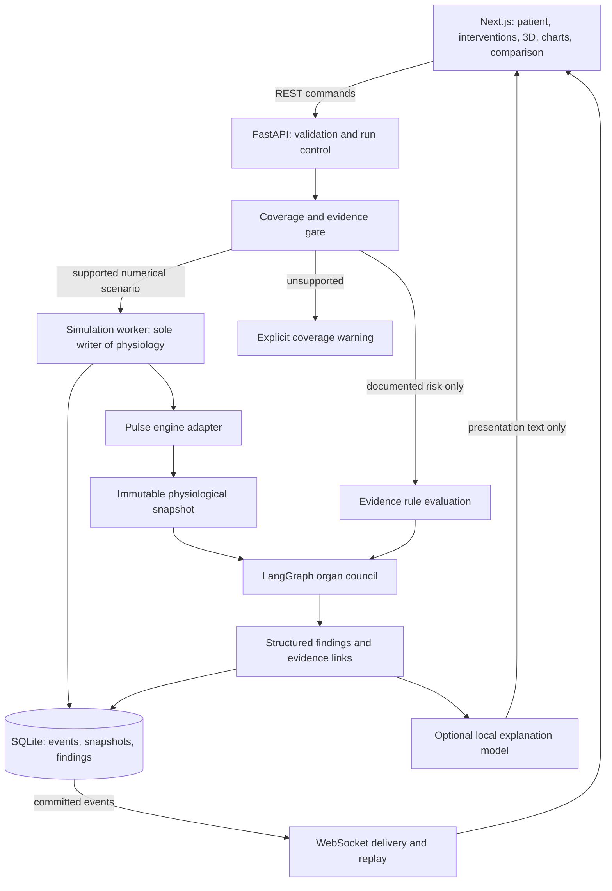

# Physiological Digital Twin Sandbox — architecture v1

Date: 2026-10-03. Status: proposed architecture; implementation and engine compatibility have not been tested.

## 1. Design brief

Build a local research and education sandbox in which a user defines a synthetic patient, schedules medications and physiological stressors, watches a physiological council evaluate organ responses, and forks a scenario to compare an intervention with a baseline. The user wants a compelling hackathon demonstration with no paid API dependency.

Confirmed constraints: 48-hour deadline; five teammates, with two primary builders; 16 GB DDR5 RAM; AMD Ryzen 5 PRO 6650U; reported 512 MB AMD graphics. Synthetic patient inputs, no EHR integration, and a local presentation are design assumptions. Treat the reported graphics budget conservatively even if the integrated GPU can share system memory. The goal is a reliable, scientifically transparent vertical slice. No claim of clinical validation or guaranteed hackathon placement is made.

Core demonstration question: how do volume depletion, baseline renal impairment, and a supported medication risk rule change the findings for the same synthetic patient? Diabetes is a clinical context field; its renal consequences require explicit measurements or disclosed assumptions. A diabetes checkbox does not generate an arbitrary injury multiplier.

## 2. Approach selection

| Approach | Strength | Tradeoff | Decision |
| --- | --- | --- | --- |
| Numerical physiology engine with deterministic organ agents and curated evidence | Coupled physiology, reproducibility, understandable findings | Requires a coverage audit and integration work | Selected |
| Rules-only organ sandbox | Quick to build; useful for documented interaction warnings | Cannot independently justify quantitative physiology trajectories | Supported evidence-only capability, clearly labeled |
| LLM-driven organ council | Flexible dialogue and narration | Unreliable quantitative state, reproducibility, and physiological conservation | Optional explanation only |

The four original organs remain the core council. Endocrine/metabolic support is an extension for glucose regulation, insulin, and related conditions. It must not be claimed from a metadata flag alone.

## 3. Architecture and deployment

Use a modular monolith: a Next.js browser interface, a FastAPI service, an isolated simulation worker process, and a local SQLite database. Keep the engine boundary replaceable. A future multi-user deployment can use PostgreSQL and a job queue after the local vertical slice works.

All critical demo assets, evidence extracts, and cached traces are local. Internet access is unnecessary during a rehearsed demo. External sources may be fetched during preparation and retained with provenance and applicable license information.

## 4. Concrete stack

| Concern | Choice | Boundary |
| --- | --- | --- |
| UI | Next.js App Router, TypeScript, React | Patient input and presentation only |
| Anatomy | Three.js, React Three Fiber, Drei | Organ picking, materials, motion; no physiological calculations |
| UI run state | Zustand | Selected run, cursor, rendering state; backend remains authoritative |
| Charts | Recharts | Time-series values and branch comparison |
| API and schemas | FastAPI, Pydantic | Input validation and explicitly projected output schemas |
| Council | Open-source Python LangGraph | Deterministic organ evaluation and bounded coordination |
| Whole-body model | Pulse through a Python-compatible adapter | Integration subject to the initial feasibility gate |
| Storage | SQLite, WAL mode, a single persistence writer | Local runs, lineage, evidence references, findings, and checkpoints |
| Explanation | Deterministic templates; optional local-only Ollama after core acceptance | Off by default on this laptop; consumes approved findings; no simulation writes |
| Verification | pytest and selected Playwright flows | Scientific invariants and complete demo journeys |

Use a supported Node LTS and a Python version verified against the chosen Pulse distribution. Pin tested package versions during implementation. No cloud database, paid tracing, paid LLM, mandatory vector database, Kubernetes, or distributed organ microservices in the hackathon slice. The primary path uses no language model at all; the autonomous organ evaluators provide the multi-agent behavior through explicit state, local rules, evidence retrieval, and coordination.

Laptop budget: start with one live simulation worker and run comparison branches sequentially; cache exact-input runs for instant replay. Use one WebGL canvas with a modestly sized anatomy asset, capped device pixel ratio, simple materials, and no expensive postprocessing. Target a stable 30 FPS before adding visual effects. Keep a second comparison body optional; aligned charts plus one selectable anatomy view are sufficient. Do not run a local LLM alongside the development toolchain and simulation by default. Sensitivity analysis, if reached, starts with a bounded 5–10 sample set processed sequentially; measured memory and runtime determine any increase. These are initial engineering limits, not benchmark results.

PK-Sim/MoBi is a later adapter candidate for selected drug-exposure and metabolic-interaction cases. Review its GPLv2 licensing before distributing integrations. Do not run Pulse clearance and PK-Sim clearance against the same substance simultaneously. Each physiological quantity has exactly one authoritative model owner.

## 5. Numerical engine and capability gate

The engine adapter exposes capabilities(), initialize(profile, assumptions), apply_event(event), advance(delta_seconds), snapshot(), serialize(), and restore(checkpoint). The worker schedules events and advances engine time; the council never owns the numerical integration loop.

The first implementation activity is a time-boxed Pulse feasibility check, budgeted at four hours within a 48-hour build:

1. Obtain a compatible SDK/runtime and run a documented reference scenario on the actual laptop.
2. Verify loading and serializing a baseline state, reading requested metrics, and applying one supported condition/intervention.
3. Record supported drug substances, routes, conditions, patient parameters, and measured run speed.
4. Produce a capability manifest and one provenance-bearing reference trace.

Do not assume ibuprofen, ACE inhibitors, arbitrary renal impairment, or diabetes pathophysiology are quantitatively supported. Coverage is resolved per quantity and scenario, not by the presence of a drug name in a file.

Every result quantity has one capability label:

- `engine_simulated`: the selected engine supports the intervention and output; application-specific validation status remains separately visible.
- `evidence_only`: a documented rule supports a qualitative warning; no drug-induced numerical change is generated from this warning.
- `illustrative`: an explicitly labeled educational model or synthetic schematic; never presented as a patient prediction.
- `unsupported`: insufficient model coverage or necessary inputs.

The initial demo can combine simulated fluid-state physiology with an evidence-only NSAID warning. If the medication effect is not numerically modeled, UI comparisons must state this and must not attribute fluid-state chart differences to the medication. The drug counterfactual then compares documented findings, while the hydration counterfactual compares supported physiological trajectories.

If live engine integration exceeds the feasibility budget, use an actual previously generated engine trace with complete provenance in visible replay mode. Arbitrary patient changes disable that trace; cached traces are keyed to exact scenario inputs. A hand-authored animation is not an engine trace. If no executable engine or reference trace is available, publish the evidence-only capability transparently and do not claim a numerical twin.

## 6. State and ownership

One simulation worker owns each run. There is one authoritative physiological state. Each agent owns its finding history and bounded local evaluation state, not a second conflicting copy of blood pressure or drug concentration.

Data contracts:

| Contract | Required content |
| --- | --- |
| PatientProfile | synthetic ID; age; model-required sex parameter; mass in kg; baseline measurements with units, measurement times, source, and missingness; conditions; current medications; allergies |
| Intervention | event ID; ingredient ID; dose and unit; route; formulation where relevant; simulation time; duration; idempotency key |
| SimulationConfig | engine and model versions; profile hash; parameter set; solver configuration; seed if stochastic components exist; rule/evidence versions; requested horizon; sampling cadence; assumptions |
| PhysiologySnapshot | run ID; sequence; simulation time in seconds; quantities with units and source/model owner; coverage flags; validity and numerical-error indicators |
| AgentFinding | organ; finding ID; category; severity; actual inputs; rule/model reference; evidence IDs; assumptions; model coverage; parent finding/event IDs; onset time; resolution state |
| RunEvent | schema version; run ID; sequence; simulation time; wall-clock time; type; payload; parent causal IDs |
| Checkpoint | engine serialized state; event cursor; agent state; pending schedule; model/version identifiers; content hash |
| ReviewRecord | reviewer label; review time; finding/run references; acknowledged limitations; notes; status |

Missing measurements remain missing. Defaults are explicitly identified as assumptions. A clinical diagnosis does not supply a nonexistent measured eGFR, glucose, or liver function value.

## 7. Council behavior and message passing

Every council evaluation reads the same immutable engine snapshot. The organ nodes can evaluate concurrently without sharing writable numerical fields. Findings are merged in deterministic organ/finding-ID order, followed by a consistency and evidence node. Prior organ messages may contribute context at the next bounded evaluation step. Physical cross-organ feedback comes from the coupled engine.

| Agent | Reads | Produces |
| --- | --- | --- |
| Renal | modeled renal outputs, baseline renal measurements, volume state, relevant drugs/rules | filtration/perfusion findings, clearance coverage warnings, missing renal-data requests |
| Cardiovascular | modeled pressure, heart rate, perfusion, volume state, relevant renal findings | hemodynamic threshold findings and cross-organ context |
| Hepatic | available drug exposure/clearance, hepatic measurements and evidence | metabolism-related findings or explicit unavailable-model status |
| Respiratory | modeled respiratory rate, oxygenation and gas-exchange outputs, relevant medications | ventilation/oxygenation findings or evidence-only respiratory warnings |

Agents may autonomously request relevant evidence from the local registry and request a supported sensitivity run. Requests pass through deterministic limits and the run controller. They cannot invent dosing recommendations or silently modify interventions.

LangGraph coordinates evaluation at intervention boundaries, meaningful state changes, and a bounded assessment cadence. It does not checkpoint every internal solver iteration. Its super-step boundaries are workflow boundaries, not units of physiological time.

A finding's explanation is a stored derivation: input facts + fired rule/model + source + limitations. Do not present hidden chain-of-thought or an LLM transcript as clinical evidence. Causal arrows distinguish model-produced dependencies from literature-described mechanisms and temporal associations.

## 8. Simulation lifecycle

1. Validate profile, units, intervention schedule, and requested horizon.
2. Check capabilities and surface unsupported outputs and missing measurements.
3. Initialize/stabilize a supported engine state; save it for reuse.
4. Persist the run configuration and accepted intervention events.
5. Apply scheduled interventions at simulation time, splitting an advance interval if an event falls inside it.
6. Advance the engine using its own integration semantics.
7. Capture an output snapshot at the configured sampling interval.
8. Evaluate relevant council nodes; merge findings and verify consistency.
9. Commit snapshot, events, and findings through the persistence writer.
10. Stream committed output to the browser. Repeat until horizon, pause, cancellation, or error.

Separate three clocks: engine integration time, output/assessment sampling, and browser animation frames. Accelerated playback changes presentation speed; engine-time behavior does not depend on WebSocket latency or animation frame rate.

UI streaming target: 2–5 compact updates per second, with 30–60 visual frames per second on suitable hardware. These are performance targets, not measured results. Simulation speed is established on the actual laptop. The engine adapter can use coarser output sampling without changing its underlying integration step.

Run states: queued, initializing, running, paused, completed, cancelled, failed. Human review is a separate status and does not convert a simulation into a validated clinical prediction.

## 9. Scenario branching and comparison

Fork from a saved checkpoint before the intervention to be changed. If the intervention already happened, restore an earlier checkpoint and rerun; do not erase a drug's past exposure from the current state.

Persist parent run ID, checkpoint ID, branch differences, and parameter/configuration hashes. Compare quantities on a shared simulation-time axis. Pair baseline parameter samples between branches for sensitivity comparisons. Show changed inputs before outcomes. Report metric deltas only for quantities both branches support with compatible units and models.

Comparison types:

- Physiological comparison: supported numerical state trajectories.
- Evidence comparison: which curated rules fire under each medication/context choice.
- Sensitivity comparison: how specified plausible parameter ranges affect model outcomes.

Sensitivity envelopes are labeled as parameter-sensitivity ranges. They are not patient outcome probabilities, calibrated confidence intervals, or a predicted percentage chance of injury.

## 10. Evidence registry

Maintain versioned local JSON/YAML rules and source extracts. Each rule specifies supported ingredients/classes, preconditions, contraindication/interaction mechanism, qualitative severity rubric, source URL, source section, label/set ID where available, publication or retrieval date, rule version, review status, and limits.

Use DailyMed labeling and authoritative mechanism sources as initial material. RxNorm can normalize ingredient names, but it is not an interaction checker. NLM discontinued the RxNav drug-drug interaction API in January 2024.

Separate draft rules from reviewed rules. Draft extraction, including any LLM-assisted extraction, does not enter the primary demo evidence path until reviewed. If a clinician has not reviewed a rule, display its actual review status. A pair with no curated rule yields coverage unknown, not clearance to use it.

Avoid a vector database for the initial small formulary. Ingredient/class IDs and indexed source sections provide deterministic retrieval. Retain licensing and redistribution information for all imported models, evidence, and anatomical assets.

## 11. Frontend experience

One main simulation workspace:

- Left: synthetic patient profile, actual baseline measurements and missing inputs, intervention schedule.
- Center: selectable anatomy and aligned physiological charts.
- Right: organ council findings with input/rule/source drill-down.
- Bottom: simulation timeline, pause/play, scrubbing, and fork controls.

Compare mode aligns two branches and highlights changed inputs, trajectories, and findings. A compact methodology panel shows engine/model version, coverage, assumptions, execution mode, and review status. The primary action is Run scenario. Fork scenario appears after a checkpoint exists.

Health display combines text and color: within modeled thresholds, monitor, critical modeled threshold, and unknown/out of coverage. A stale-data badge is independent of severity. No arbitrary 0–100 organ health score. Evidence-only risk findings can highlight an organ, but the legend and selected finding explicitly label them as rule-based warnings. Green is not a guarantee of safety.

3D is progressive enhancement: if WebGL or an anatomical asset fails, retain organ cards, charts, rules, and replay controls. Use locally bundled, licensed GLB assets. A stylized organ view is an acceptable visual fallback if labeled and anatomically restrained.

## 12. API and persistence

Endpoints:

- GET /capabilities — model and scenario coverage.
- GET /scenarios — local curated presets with capability and provenance metadata.
- POST /runs — validate and create an immutable run configuration.
- GET /runs/{id} — configuration, status, limitations, and latest committed sequence.
- POST /runs/{id}/commands — idempotent pause/resume/cancel; supported new interventions at valid future simulation times.
- POST /runs/{id}/forks — branch from a checkpoint with explicit changes.
- GET /runs/{id}/events?after_seq=N — catch-up and replay in pages.
- GET /runs/{id}/compare?other_run_id=X — aligned supported outcomes and evidence findings.
- POST /runs/{id}/reviews — persist review notes and limitation acknowledgments.
- GET /evidence/{id} — stored source sections and provenance.
- WS /runs/{id}/stream?after_seq=N — sequenced committed updates and status.

Tables: patient_profiles, runs, interventions, snapshots, events, checkpoints, findings, evidence_sources, rule_versions, and reviews. Hash model/configuration artifacts and retain their version identifiers. The log provides traceability; local hashes alone do not make the database tamper-proof.

Only a single writer commits SQLite changes. CPU-bound simulation happens in a worker process, and IPC carries bounded messages. A slow browser does not stall the solver. Transient display snapshots can be coalesced, but authoritative events remain persisted. Reconnection replays after the acknowledged sequence, then switches to live output. Reads are paginated; full runs are not copied into every message.

## 13. Failure behavior

- Invalid units/doses/routes: reject before applying; never guess conversions between incompatible units.
- Numerical invalidity or failed stabilization: mark failed with diagnostic context; retain last valid output visibly marked stale.
- Unsupported drug or condition: emit explicit coverage findings; numerical effects remain unavailable.
- Evidence failure: show unavailable evidence status; do not invent a source.
- Worker failure: retain committed events and checkpoint; resumption requires compatible versions, otherwise replay only.
- WebSocket loss: show disconnected/stale state, fetch missing events, reconnect without applying interventions twice.
- Optional LLM failure: template explanation remains available; simulation continues.
- WebGL failure: retain accessible charts and organ cards.

Bound queues, scenario horizons, parameter samples, and concurrent runs. Bind to localhost for the initial synthetic demo, use explicit local-origin rules, and disable cloud telemetry where possible. Remote access and real patient data require a separate deployment/privacy design.

## 14. Hackathon scope and build order

Must ship: one coverage-audited scenario family; synthetic profiles; at least one supported physiology trace; deterministic four-organ evaluation; reviewed or transparently marked evidence; replay; a branch comparison; selectable organs; evidence drill-down; and visible missing-input behavior.

Suggested presets: reference fluid state, supported volume-depleted state, and the same clinical context with a curated NSAID risk warning. A two-medication rule can be added only after source review and coverage annotation. Quantitative renal impairment and drug-induced changes are enabled only when verified. Diabetes remains visible context with explicit renal/glucose inputs and unmodeled-mechanism labels.

48-hour work allocation:

| Window | Deliverable | Exit evidence |
| --- | --- | --- |
| Hours 0–4 | Engine feasibility and scope freeze | executable reference trace, capabilities, compatible runtime |
| Hours 4–14 | End-to-end numerical/evidence core | create run, persist snapshot and finding, stream to basic UI; lock shared data contracts early |
| Hours 14–24 | Council, replay, and branching | explain a finding; fork and reproduce a run |
| Hours 24–34 | Anatomy, charts, comparison, missing data | usable complete demonstration journey |
| Hours 34–42 | Verification and performance | invariant report, offline rehearsal, recovery checks |
| Hours 42–48 | Presentation polish and packaging | reliable three-minute demo, local launch instructions, explicit coverage slide |

Stretch items, in order: bounded sensitivity analysis; optional local explanation; second independently evaluated scenario; PK-Sim adapter; endocrine model. EHR import, real patient records, automatic clinical recommendations, broad surgical prediction, and arbitrary drug mixtures are outside this hackathon slice.

Team allocation:

- Primary builder A: Python service, engine adapter, LangGraph council, run persistence, branching, and stream contract.
- Primary builder B: patient/intervention workspace, anatomy, charts, replay controls, evidence drawer, and branch comparison.
- Supporting teammate C: collect a small evidence pack, check ingredient/class identities and sources, record review status and model coverage. A teammate's source check is not represented as clinician validation.
- Supporting teammate D: run independent scenario checks, repeatability and reconnect tests, and offline rehearsal; keep a short defects list.
- Supporting teammate E: obtain licensed assets, prepare synthetic patient stories, maintain launch/replay backup instructions, and rehearse the pitch.

All five can contribute early: agree on contracts and one synthetic scenario in the first hour. Keep the two builder tracks integrated through an early end-to-end run, then merge small completed features continuously. Protect the final six hours for verification, packaging, and presentation instead of adding another subsystem.

## 15. Verification and acceptance criteria

Scientific checks:

- Repeat the same engine/model/configuration inputs within defined numerical tolerances; order findings deterministically.
- Compare selected reference outputs with documented engine scenarios; record quantities, tolerances, versions, and deviations.
- Check supported physical invariants, nonnegative quantities where applicable, event timing, and invalid-state detection.
- Test each evidence rule with positive, negative, and missing-data cases, independently of the rule implementation.
- Ensure unsupported medication effects never produce attributed numerical trajectories.
- Verify thresholds are justified and unit-aware; descriptive risk categories are not uncalibrated probabilities.
- Compare branch behavior with a rerun from the same pre-intervention checkpoint.

Engineering checks:

- Complete create → run → inspect evidence → scrub → fork → compare → review flow.
- Disconnect and recover the stream with ordered output and no duplicate interventions.
- Pause/cancel without leaked workers; restart and recover compatible saved runs.
- Rehearse with network disconnected and WebGL disabled.
- Measure startup, initialization, scenario time, memory, and UI responsiveness on the actual machine.

The prototype passes when this complete journey works on the demonstration laptop, coverage labels are accurate, every primary finding has an input/rule/source derivation, cached output has true provenance, and failures retain an understandable state. No claim of clinical validity follows from passing software tests.

## 16. Three-minute presentation

0:00–0:25 — Introduce a synthetic patient and the question: how does the modeled context change under a planned stressor?

0:25–1:10 — Run the supported scenario; show the organ findings and measured/model-derived quantities. State which medication effects are evidence-only.

1:10–1:45 — Click a renal finding and show the input values, physiological mechanism, source, and model limits.

1:45–2:25 — Fork before a supported intervention, alter one input, and compare aligned results. Compare rule findings separately when the drug effect lacks numerical support.

2:25–2:45 — Remove a required input or select an unsupported combination; show that the system identifies what it cannot estimate.

2:45–3:00 — Show reproducibility, offline execution, and the zero-paid-API stack. Describe the path to patient-specific validation.

Pitch: “A local physiological sandbox that lets users compare supported scenarios and inspect the evidence behind each organ finding.” The strongest demonstration is a traceable counterfactual with honest uncertainty and reliable execution.

## 17. Architectural decisions and future path

- Local modular monolith reduces deployment and debugging work while preserving module boundaries.
- A single numerical state owner prevents divergent organ calculations and double-counted effects.
- LangGraph coordinates organ evaluations and review; numerical integration stays inside the engine.
- Event persistence and checkpoints enable replay, branch lineage, and stream recovery.
- Evidence and numerical-model coverage are tracked independently.
- Templates guarantee explanatory availability; optional local AI improves phrasing only.
- PK-Sim integration follows selected compound-model evaluation; endocrine support follows a separate glucose-regulation design.
- PostgreSQL, authenticated remote access, and a durable job queue are added when multi-user requirements justify them.

For a later Vercel frontend deployment, installing the CLI with `npm i -g vercel` is strongly recommended to enable deployment, environment management, and log inspection. The local architecture does not depend on Vercel. Remote worker networking and data handling would need their own design before publishing a connected clinical interface.

## 18. Evidence and documentation consulted

- Pulse overview and Python interface: https://pulse.kitware.com/
- Pulse licensing, validation scope, state initialization, and uncertainty limits: https://pulse.kitware.com/_f_a_q.html
- Pulse pharmacokinetic and lower-fidelity pharmacodynamic methodology: https://pulse.kitware.com/_drugs_methodology.html
- Pulse patient model: https://pulse.kitware.com/_patient_methodology.html
- Pulse tissue methodology and dehydration condition: https://pulse.kitware.com/_tissue_methodology.html
- OSP use-case qualification reports: https://www.open-systems-pharmacology.org/OSP-Qualification-Reports/
- PK-Sim repository and licensing: https://github.com/Open-Systems-Pharmacology/PK-Sim
- LangGraph state, nodes, reducers, and super-steps: https://docs.langchain.com/oss/python/langgraph/graph-api
- DailyMed labeling and access: https://dailymed.nlm.nih.gov/
- NLM interaction API discontinuation: https://lhncbc.nlm.nih.gov/RxNav/?id=rximageapi_support
- NIDDK NSAID, dehydration, and kidney-risk explanation: https://www.niddk.nih.gov/health-information/kidney-disease/keeping-kidneys-safe
- FDA risk-informed computational-model credibility guidance: https://www.fda.gov/regulatory-information/search-fda-guidance-documents/assessing-credibility-computational-modeling-and-simulation-medical-device-submissions

Consulted 2026-10-03. This is a proposed design informed by official documentation; no SDK installation, model benchmarking, clinician review, or clinical validation has been performed in this architecture task.
